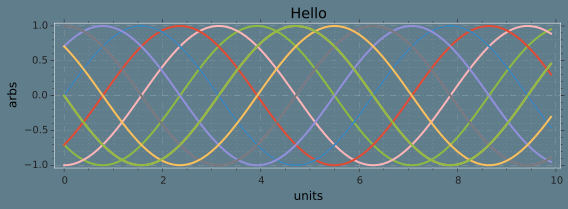

# Testing plot formatting 

{%highlight python lineos}
    %matplotlib inline
    %config InlineBackend.figure_format = 'svg'
    
    import numpy as np
    import matplotlib.pyplot as plt
    
    import os 
    fdir = os.getcwd()
    plt.style.use(fdir +'/blog.mplstyle')
    
    
    x=np.arange(0,10,0.1)
    
    ax=plt.subplot(1,2,1)
    for j in np.arange(0,np.pi,2/8.):
        yx = map(lambda y: np.sin(y +j*np.pi),x)
        plt.plot(x,yx)
    
    def plt_setup(obj, params):     
            obj.margins(0.02)
            obj.margins(0.02)
            obj.yaxis.set_ticks_position('left')
            obj.minorticks_on()
            obj.grid(b=True, which='minor', color='w', linestyle=':',linewidth=0.1)
            obj.tight_layout()
    plt_setup(plt,0)
    
    plt.title('Hello')
    plt.xlabel('units')
    plt.ylabel('arbs')
    
    
    ax=plt.subplot(1,2,2)
    for j in np.arange(0,np.pi,2/8.):
        yx = map(lambda y: np.sin(y +j*np.pi),x)
        plt.plot(x,yx)
    
    plt.title('Hello')
    plt.xlabel('units')
    plt.ylabel('arbs')
    plt_setup(plt,0)
    
{%endhighlight}

    ---------------------------------------------------------------------------
    AttributeError                            Traceback (most recent call last)

    <ipython-input-10-16aedcf76562> in <module>()
         24         obj.grid(b=True, which='minor', color='w', linestyle=':',linewidth=0.1)
         25         obj.tight_layout()
    ---> 26 plt_setup(plt,0)
         27 
         28 plt.title('Hello')

    <ipython-input-10-16aedcf76562> in plt_setup(obj, params)
         20         obj.margins(0.02)
         21         obj.margins(0.02)
    ---> 22         obj.yaxis.set_ticks_position('left')
         23         obj.minorticks_on()
         24         obj.grid(b=True, which='minor', color='w', linestyle=':',linewidth=0.1)

    AttributeError: 'module' object has no attribute 'yaxis'

# Testing 123

    ax=plt.subplot(1,1,1)
    for j in np.arange(0,np.pi,2/8.):
        yx = map(lambda y: np.sin(y +j*np.pi),x)
        plt.plot(x,yx)
    
    plt.title('Hello')
    plt.xlabel('units')
    plt.ylabel('arbs')
    plt_setup(plt,0)

Testing some equations $x= \pi \Gamma \int 1 dx $ as well as full line equations

\begin{align}
f(x) &= 10x^2 + \int dx e^{-x^2}
\\
g(x) &= \sum_{n=0} \frac{ n^2 }{ n!}
\end{align}

this is still a test.

testing another cell, $\kappa = \tau / 2$ and again full line equation

\begin{equation}
F(x) = G_{self} \int_0 ^\infty \kappa \Gamma e^{-x^2} dx
\end{equation}

    
