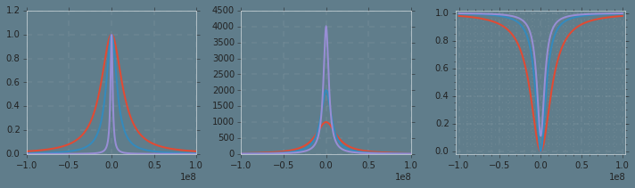

##     Making figures

I think an absurd amount of time is spent making figures... Its kind of
ridiculous how easy it is to lay out a physical scenerio with equations that is
picture perfect to me, but would require a great deal of effort for a reader to
translate. And in contrast how long it takes to make a concise figure which
represents the physical situation under study which would be immediately clear
to a reader. Of course, good science requires both and there is no excuse other
than being lazy not to spend the appropriate amount of time on both.

I believe the lack of ease in creating decent figures is in large part
reasonsible for the precieved 'genius' in research, rather than the much more
accurate hard work and time involved in developing published results. It seems
to be straight forward to polish results to the point where all necessary
information is contained in the final product yet contains very little of the
intuition or experience gained to obtain said results. and I think the gap lies
in decent figures.


    %load_ext tikzmagic


    The tikzmagic extension is already loaded. To reload it, use:
      %reload_ext tikzmagic


    %%tikz  -l arrows,arrows.meta, -s 500,200 -sc 1 -f svg -S 2016-05-23/mirror.svg
        \tikzset{Mirror/.style={rounded corners=0.2,-,thick,black,bottom color=blue!25, top color=blue!70,shading angle=-45}}
        
        \tikzset{Beam/.style={rounded corners=0.02,-{Triangle[width=3,length=3]},line width = 1 ,draw=red,text=black}}
        
        %Draw mirror
        \filldraw [Mirror]  (45:1) arc(45:-45:1) 
                                    -- ++(0,-0.15)
                                    -- ++ (0.75,0) 
                                    -- ++ (0,0.3+1.41) 
                                    -- ++ (-0.75,0) 
                                    --  cycle ;
        %Draw modes
        \draw [Beam] 
                (-1.5,-0.5) -- node[above,scale=1] {$$}+(1.5,0);    
        \draw [Beam] 
                (0.05,-0.5) to[controls=+(0:1) and +(0:1)]  (0,0.5);
        \draw [Beam] 
                (-0.05,0.5) --  node[below,scale=1] {$r$}+(-1.5,0);
        \draw [Beam] 
                (0.05,-0.5)  to[controls=+(0:1) and +(-35:1)] (0.15,0.95) node[left,scale=1] {${l}$};
    
        \draw [Beam] 
                (1.75,0.) --  node[below,scale=1] {$t$}+(1.,0);



    %%tikz  -l arrows,arrows.meta, -s 500,200 -sc 1 -f svg -S 2016-05-23/mirrormodes.svg
        \tikzset{Mirror/.style={rounded corners=0.2,-,thick,black,bottom color=blue!25, top color=blue!70,shading angle=-45}}
        
        \tikzset{Beam/.style={rounded corners=0.02,-{Triangle[width=3,length=3]},line width = 1 ,draw=red,text=black}}
        
        %Draw mirror
        \filldraw [Mirror]  (45:1) arc(45:-45:1) 
                                    -- ++(0,-0.15)
                                    -- ++ (0.75,0) 
                                    -- ++ (0,0.3+1.41) 
                                    -- ++ (-0.75,0) 
                                    --  cycle ;
        %Draw modes
        \draw [Beam] 
                (-1.5,-0.5) -- node[above,scale=0.75] {$a_{in}$}+(1.5,0);    
        \draw [Beam] 
                (0.05,-0.5) to[controls=+(0:1) and +(0:1)]  (0,0.5);
        \draw [Beam] 
                (-0.05,0.5) --  node[below,scale=0.75] {$a_{r}$}+(-1.5,0);
        \draw [Beam] 
                (0.05,-0.5)  to[controls=+(0:1) and +(-35:1)] (0.15,0.95) node[left,scale=0.75] {${a_l}$};
    
        \draw [Beam] 
                (1.75,0.) --  node[below,scale=0.75] {$a_{t}$}+(1.,0);


# Planar Fabry-perot optical resonator

The derivation for the properties stated here can be found in [1,2,3]. For our
purposes an optical resonator can be completely described by the mirror surface
profiles, (ROC1,ROC2), and the transmission and loss coefficient for each mirror
$t$, $l$, $r^2 + t^2 -l^2 = 1$.


    %%tikz  -l arrows,arrows.meta, -s 500,200 -sc 1 -f svg -S 2016-05-23/cavitymodes.svg
        \tikzset{Mirror/.style={rounded corners=0.2,-,thick,black,bottom color=blue!25, top color=blue!70,shading angle=-45}}
        
        \tikzset{Beam/.style={rounded corners=0.02,-{Triangle[width=3,length=3]},line width = 1 ,draw=red,text=black}}
        
        %Draw mirror
        \filldraw [Mirror]  (45:1) arc(45:-45:1) 
                                    -- ++(0,-0.15)
                                    -- ++ (0.75,0) node[below,scale=0.5] {M1}
                                    -- ++ (0,0.3+1.41) 
                                    -- ++ (-0.75,0) 
                                    --  cycle ;                        
                            
         %Draw mirror
        \filldraw [Mirror]  (-135:1) arc(-135:-225:1) 
                                    -- ++(0,0.15) 
                                    -- ++ (-0.75,0) 
                                    -- ++ (0,-0.3-1.41) node[below,scale=0.5] {M0}
                                    -- ++ (0.75,0) 
                                    --  cycle ;
                            
        %Draw circulating
        \draw [Beam] 
                (-0.15,-0.5) -- node[above,scale=0.75] {}+(0.3,0.0);    
        \draw [Beam] 
                (0.2,-0.5) to[controls=+(0:1) and +(0:1)]  (0.2,0.5);
        \draw [Beam] 
                (0.15,0.5) --  node[below,scale=0.75] {}+(-0.3,0);
        \draw [Beam] 
                (-0.2,0.5) to[controls=+(180:1) and +(180:1)]  (-0.2,-0.5);
        \node (0,0) {$a_{c}$};
        
        %draw entrance and exit modes
        \draw [Beam] 
                (1.75,0.) --  node[below,scale=0.75] {$a_{t}$}+(1.,0);
         \draw [Beam] 
                (-2.75,-0.25) --  node[below,scale=0.75] {$a_{I}$}+(1.,0);        
        \draw [Beam] 
                (-1.75,-0.25) to[controls=+(0:0.35) and +(0:0.35)]  (-1.80,0.25);
        \draw [Beam] 
                (-1.8,0.25) --  node[below,scale=0.75] {$a_{r}$}+(-1.,0);


Each mode can be connected by beam splitter relations given by the mirror
coupling coefficients, $U_{BS} = \begin{pmatrix} t & r \\ -r & t^*
\end{pmatrix}$ satisfying the stokes relations.

\begin{align}
    \begin{pmatrix} a_c^{(0)} \\\ a_r \end{pmatrix}   &= U_{BS,1}
\begin{pmatrix} a_I \\\ a_{c}^{(rt)}  \end{pmatrix} = \begin{pmatrix} t_1 a_i +
r_1 a_c^{(rt)} \\\ -r_1 a_i + t_1^* a_c^{(rt)}\end{pmatrix}
    \\\
    \begin{pmatrix} a_c^{rt'} \\\ a_t \end{pmatrix} &= U_{BS,2} \begin{pmatrix}
a_v \\\ a_{c}^{(0')}  \end{pmatrix} = \begin{pmatrix} t_2 a_v + r_2 a_c^{(0')}
\\\ -r_2 a_v + t_2^* a_c^{(0')} \end{pmatrix}
    \\\
    \quad a_{c}^{(0')} &= a_{c}^{(0)}e^{-i\phi} , a_c^{(rt')} = a_c^{(rt)}
e^{i\phi}
    \end{align}

Here $a_c^{(0)}, a_c^{(rt)}$ are the right-going / round-trip modes
respectively, and $a_v$ is the vacuum input on mirror M1. Primes for the cavity
modes distinguish surface M0 and M1, corresponding to a phase difference $\phi =
\frac{\omega L}{c} $ due to the cavity length $L$. Solving the above set of
equations, gives the following relations.

\begin{align}
a_c &= \frac{ t_1 }{ 1 - r_1r_2 e^{-i\frac{ \omega }{ FSR } } } a_{i}
\\\
a_r &= \frac{ -r_1 - ( r_1^2 + \lvert t_1^2\rvert ) r_2e^{-i \frac{ \omega }{
FSR}} }{1 - r_1 r_2 e^{-i \frac{ \omega }{ FSR} } }
\\\
a_t &= \frac{- t_1 t_2^* e^{-i \frac{ \omega }{2 FSR} } }{ 1 - r_1 r_2 e^{-i
\frac{ \omega }{ FSR} }}
\end{align}

With $FSR = \frac{ c }{2L} $. These expressions are for the steady-state field
operators, because characterization of these properties will be done measing
intensities it is useful to write down the forms for these instead. Most
important of these is the intra-cavity intensity.

\begin{align}
I_c &= a_c^\dagger a_c = \frac{ \lvert t_1 \rvert ^2}{ \lvert 1- r_1 r_2 e^{i
\omega/FSR} \rvert } I_{i}
= \frac{ \lvert t_1 \rvert ^2}{ (1-r_1 r_2)^2 + 4 r_1 r_2 \sin^2 \left(\frac{
\omega }{2FSR}  \right)} I_i
\\
&= \frac{ I_{max} }{ 1 + \left( \frac{ 2 F }{ \pi }\right)^2  sin^2 \left(
\frac{ \omega }{ 2 FSR} \right) }
\overset{\omega \ll FSR}{\approx} \frac{ I_{max} }{ 1 + \left( \frac{ 2 F }{ \pi
}\right)^2 \left( \frac{ \omega }{ 2FSR } \right)^2 } = \frac{ I_{max} }{ 1 +
\left( \frac{ 2 \omega }{ \Gamma} \right)^2 }
\end{align}

Ending in the standard Cauchy-distribution form. With $I_{max} = \frac{ \rvert
t_1 \rvert ^2 I_{i} }{ (1-r_1 r_2 )^2 }$,  the finesse $F = \pi  \frac{ \sqrt{
r_1 r_2 }}{ (1 - r_1 r_2 )  }$ and the resonance width (FWHM) $\Gamma = 2\pi
\frac{ FSR }{ F } $.

\begin{align}
I_{r} &= \frac{ -r_1 }{ ( 1 - r_1 r_2 )^2 } \frac{  \left( 1+ \frac{ (r_1^2 +
\lvert t_1 \rvert ^2 )r_2}{r_1}\right)^2 - 4\frac{ (r_1^2 + \lvert t_1 \rvert
^2)r_2}{r_1} \sin^2 \left( \frac{ \omega}{2FSR} \right) }
{1 + \left( \frac{ 2 F }{ \pi }\right)^2  sin^2 \left( \frac{ \omega }{ 2 FSR}
\right) }
\\\
I_t &=  \lvert t_2 \rvert ^2  I_{cav}
\end{align}


    %matplotlib inline
    #Cavity equations
    import numpy as np
    import scipy.constants as spc
    import matplotlib.pyplot as plt
    
    import os 
    fdir = os.getcwd()
    plt.style.use(fdir +'/2016-04-30/blog.mplstyle')
    
    c= spc.c
    print c
    def plt_setup(obj, params):     
                obj.margins(0.02)
                obj.margins(0.02)
                obj.minorticks_on()
                obj.grid(b=True, which='minor', color='w', linestyle=':',linewidth=0.1)
                obj.tight_layout()
    
    def Icav(w, T1, T2, L1, L2, lngth):
        t1 = np.sqrt(T1)
        t2 = np.sqrt(T2)
        r1 = np.sqrt(1 - T1 - L1)
        r2 = np.sqrt(1 - T2 - L2)
        FSR = c / (2 * lngth)
        F = np.pi * np.sqrt(r1 * r2) / (1 - r1 * r2)
        
        rv = ((t1**2) / (1 - r1 * r2 )**2)  / ( 1 + (2 * F / np.pi)**2 * (np.sin(w / (2*FSR)) )**2 )
        return rv
    
    def Irefl(w, T1, T2, L1, L2, lngth):
        t1 = np.sqrt(T1)
        t2 = np.sqrt(T2)
        r1 = np.sqrt(1 - T1 - L1)
        r2 = np.sqrt(1 - T2 - L2)
        FSR = c / (2 * lngth)
        F = np.pi * np.sqrt(r1 * r2) / (1 - r1 * r2)
        
        rv =  ( ((r1) / (1 - r1 * r2 )**2)  / ( 1 + (2 * F / np.pi)**2 * (np.sin(w / (2*FSR)) )**2 ) ) * ( 
        (1 + ( r1**2 + t1**2) * r2 / r1)**2 - 4 * ( (r1**2 + t1**2) * r2 / r1) * (np.cos(w / (2*FSR)))**2 )
        return rv
    
    def Itrans(w, T1, T2, L1, L2, lngth):
        t1 = np.sqrt(T1)
        t2 = np.sqrt(T2)
        r1 = np.sqrt(1 - T1 - L1)
        r2 = np.sqrt(1 - T2 - L2)
        FSR = c / (2 * lngth)
        F = np.pi * np.sqrt(r1 * r2) / (1 - r1 * r2)
        
        rv = t2**2 * ((t1**2) / (1 - r1 * r2 )**2)  / ( 1 + (2 * F / np.pi)**2 * (np.sin(w / (2*FSR)) )**2 )
        return rv
    
    
    f = np.vectorize(Itrans)
    
    plt.subplot(1,3,1)
    freq = np.arange(-100E6, 100E6,1E5)
    
    plt.plot(freq,f(freq,1E-3,1E-3,0,0,0.01))
    plt.plot(freq,f(freq,5E-4,5E-4,0,0,0.01))
    plt.plot(freq,f(freq,1E-4,1E-4,0,0,0.01))
    
    f = np.vectorize(Icav)
    
    plt.subplot(1,3,2)
    plt.plot(freq,f(freq,1E-3,1E-3,0,0,0.01))
    plt.plot(freq,f(freq,5E-4,5E-4,0,0,0.01))
    plt.plot(freq,f(freq,2.5E-4,2.5E-4,0,0,0.01))
    
    
    f = np.vectorize(Irefl)
    
    plt.subplot(1,3,3)
    plt.plot(freq,f(freq,1E-3,1E-3,0,0,0.01))
    plt.plot(freq,f(freq,5E-4,5E-4,0,0,0.01))
    plt.plot(freq,f(freq,2.5E-4,2.5E-4,0,0,0.01))
    
    plt_setup(plt,0)



    299792458.0

$\def\ket#1{\rvert #1 \rangle}$
$\def\bra#1{\langle #1 \lvert}$

$\def \RRR{\bf R \bf R}$
The simplest description of this experiment is that of a two level system
coupled to a single electromagnetic field mode. While there are a great number
of details that this description is lacking, a large majority of the dynamics
and key features are still present. Moreover, the goal and the majority of
effort in this and many other experiments has been in reducing these details
sufficiently to observe the 'pure' features described by a two-level system
coupled to a single electromagnetic field mode. This system was first described
by Edwin Jaynes and Fred Cummings, in trying to adequently describe features to
help tuning an Ammonia maser [1].

\begin{align}
    H_{Atom} &= \hbar \omega_A \ket{ e } \bra{ e }
    \\\
    H_{F}
\end{align}


    



    4.4186318473594801e-11


    

