# The march toward 1Hz

We're back to using the 674nm laser, so its time to go through the lock setup
once again. The biggest change from the previous use is that the
prestabilization cavity has been changed to one of the 4 octa-block cavities.
The point of doing this was to reduce the prestabilization linewidth. The
previous cavity had a linewidth of ~4MHz, which given a 1mW input power was the
limiting factor for the
The new cavity was aiming for a linewidth of ~300kHz with transmission
coefficient measured to be 300ppm per mirror. The cavity linewidth was measured
to be 1.02MHz, which agrees with our transmissited power being only $T^2 \frac{
F^2 }{\pi^2} = 3%. Not a total loss, as the octablock setup has better vibration
and thermal isolation.

See bellow for measured transmission linewidth, and pdh error signal.


    %matplotlib inline
    import numpy as np
    import matplotlib.pyplot as plt
    from scipy.optimize import curve_fit
    import os 
    import string
    import UsefulFunctions
    reload(UsefulFunctions)
    fitfunc = UsefulFunctions.MFunctions()
    #setup plots
    fdir = os.getcwd()
    plt.style.use(fdir +'/2016-04-30/notebook.mplstyle')
    def plt_setup(obj, params):     
                obj.margins(0.02)
                obj.margins(0.02)
                obj.minorticks_on()
                obj.grid(b=True, which='minor', color='w', linestyle=':',linewidth=1.2)
                obj.tight_layout()
    
    #working directory
    fdir="/Users/Michael/Dropbox (MIT)/Quanta/Twins/Data/2016-06-12/"
    
    #import data
    OctaBlock_ErrSig=np.genfromtxt(fdir+"OctaBlockCavity_2/F0172CH2.CSV",
                                                           skip_header=19,
                                                           delimiter=',',
                                                           names = ["n1","n2","n3","t","V"])
    OctaBlock_Trans=np.genfromtxt(fdir+"OctaBlockCavity_2/F0172CH1.CSV",
                                                           skip_header=19,
                                                           delimiter=',',
                                                           names = ["n1","n2","n3","t","V"])
    
    #Calibrate time axis to frequency
    Fmod=28.5 #MHz
    import Peak_detect
    TransmissionPeaks=Peak_detect.detect_peaks(OctaBlock_Trans["V"], mph=0.01, mpd=70)
    OctaBlock_Trans["t"] = (OctaBlock_Trans["t"]-(OctaBlock_Trans["t"][TransmissionPeaks[1]]))*(Fmod/(OctaBlock_Trans["t"][TransmissionPeaks[1]]
                                                                            -OctaBlock_Trans["t"][TransmissionPeaks[0]]) )
    OctaBlock_ErrSig["t"] = (OctaBlock_Trans["t"]-(OctaBlock_Trans["t"][TransmissionPeaks[1]]))*(Fmod/(OctaBlock_Trans["t"][TransmissionPeaks[1]]
                                                                                -OctaBlock_Trans["t"][TransmissionPeaks[0]]) )
    #fit transmission spectrum
    guess=[0,Fmod,0.5,1,0,2.0]  # [ f0, modulation frequency, modulation depth, offset, linewidth]
    popt, pcov = curve_fit(fitfunc.CavitySideBands, OctaBlock_Trans["t"],OctaBlock_Trans["V"],p0=guess)
    testfunc = np.vectorize(fitfunc.CavitySideBands)
    
    guess2=[0,Fmod, 0 , np.pi/2.,  1, 1.1] #[f0, modulation frequency, background, phase, amplitude, linewidth]
    popterr, pcoverr = curve_fit(fitfunc.CavityErrorSignal, OctaBlock_ErrSig["t"],OctaBlock_ErrSig["V"],p0=guess2)
    print popterr
    testfunc2=np.vectorize(fitfunc.CavityErrorSignal)
    
    caption =[""]*4
    caption[0]="fitted:"
    caption[1]=r"Linewidth: $2\pi$ %f MHz "%(popt[-1])
    caption[2]=r"mod. depth: $\beta$ = %f"%(popt[-3])
    
    caption2=[""]*4
    caption2[0]="fitted:"
    caption2[1]=r"discriminate $D = %.2f$ V / MHz"%(2*popterr[-2] / (popt[-1]))
    caption2[2]=r"demodulation phase $\phi = %.2f$deg"%(popterr[-3]*180.0/np.pi)
    
    plt.subplot(1,2,1)
    plt.plot(OctaBlock_Trans["t"],OctaBlock_Trans["V"])
    plt.plot(OctaBlock_Trans["t"][TransmissionPeaks], OctaBlock_Trans["V"][TransmissionPeaks],'rx')
    plt.plot(OctaBlock_Trans["t"],testfunc(OctaBlock_Trans["t"],*popt),'y-')
    plt.xlabel("MHz")
    plt.ylabel("V")
    plt.title(r"Transmission @$400\mu W$ input")
    plt.annotate("\n".join(caption), xy=(5, 0.15)  )
    plt_setup(plt,0)
    
    plt.subplot(1,2,2)
    plt.plot(OctaBlock_ErrSig["t"],OctaBlock_ErrSig["V"])
    plt.plot(OctaBlock_ErrSig["t"],testfunc2(OctaBlock_ErrSig["t"],*popterr),'y-')
    plt.annotate("\n".join(caption2),xy=(5, 0.1))
    plt.xlabel("MHz")
    plt.ylabel("V")
    plt.title(r"Error signal @$400\mu W$ input")
    plt_setup(plt,0)



    [ -1.17452179e-01   2.85052220e+01   5.42541349e-03   3.46556624e-01
       1.15435600e-01   9.57327733e-01]

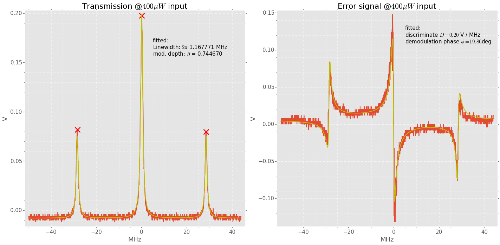

The cavity linewidth was measured independently through ring down by first
locking the cavity, then quickly < 100ns switching off the laser output. The
intensity decay was captured on the transmission photodiode, a thorlabs APD120A2
(50MHz BW).


    import scipy.constants as spc
    
    #import data
    OctaBlock_Trans=np.genfromtxt(fdir+"OctaBlockCavity_2/ALL0038/F0038CH1.CSV",
                                                           skip_header=980,
                                                           delimiter=',',
                                                           names = ["n1","n2","n3","t","V"])
    #scale time to us
    OctaBlock_Trans["t"] = 1E6*OctaBlock_Trans["t"]
    
    #fit decay
    guess=[-1,0.1,.5] #[t 0, offset, decay time ]
    popt, pcov = curve_fit(fitfunc.CavityDecay, OctaBlock_Trans["t"],OctaBlock_Trans["V"],p0=guess)
    
    FSR = spc.c / (2*0.077) 
    F= FSR*  2 * np.pi * popt[-1]*1E-6
    dv = FSR / F
    
    caption=[""]*4
    caption[0]=r"decay time: %.3f $\mu s$"%(popt[-1])
    caption[1]=r"Finesse: %.0f"%F
    caption[2]=r"Linewidth: $2\pi$ %.3f MHz"%(dv*1E-6)
    
    #plot
    testfunc = np.vectorize(fitfunc.CavityDecay)
    plt.plot(OctaBlock_Trans["t"],OctaBlock_Trans["V"])
    plt.plot(OctaBlock_Trans["t"],testfunc(OctaBlock_Trans["t"],*popt))
    plt.xlabel(r'$\mu s$')
    plt.ylabel('V')
    plt.annotate("\n".join(caption), xy=(0.5, 0.3)  )
    plt.title('OctaBlock cavity ringdown')
    plt_setup(plt,0)



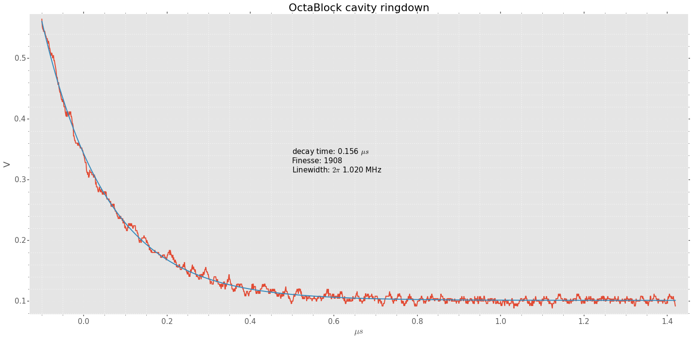

This means that the scanned transmission linewidth (measured above 1.16MHz) is
broadened by ~160kHz, suggesting the initial laser linewidth is $\Gamma_0 =
\sqrt{ \Gamma_{cav}^2 - \Gamma_{meas}^2} = 550kHz$ in a ~1ms integration time.

The peak-peak voltage in the error signal, divided by the linewidth will give
the servo gain $0.3V / 1.02MHz =  0.294 \times10^{-6} V/Hz$


    %matplotlib inline
    import numpy as np
    import matplotlib.pyplot as plt
    from scipy.optimize import curve_fit
    import os 
    fdir = os.getcwd()
    plt.style.use(fdir +'/2016-04-30/notebook.mplstyle')
    
    
    def plt_setup(obj, params):     
                obj.margins(0.02)
                obj.margins(0.02)
                obj.minorticks_on()
                obj.grid(b=True, which='minor', color='w', linestyle=':',linewidth=0.1)
                obj.tight_layout()
    
    import UsefulFunctions
    reload(UsefulFunctions)
    fitfunc=UsefulFunctions.MFunctions()
    print UsefulFunctions.MFunctions().BesselJ(2,2)
    fdir="/Users/Michael/Dropbox (MIT)/Quanta/Twins/Data/2016-06-12/"
    
    fname="0014"
    OctaBlock_ErrSig=np.genfromtxt(fdir+"Transmission_modulation/sidebands/ALL%s/F%sCH1.CSV"%(fname,fname),
                                                           skip_header=19,
                                                           delimiter=',',
                                                           names = ["n1","n2","n3","t","V"])
    OctaBlock_Trans=np.genfromtxt(fdir+"Transmission_modulation/sidebands/ALL%s/F%sCH1.CSV"%(fname,fname),
                                                           skip_header=19,
                                                           delimiter=',',
                                                           names = ["n1","n2","n3","t","V"])
    
    Fmod=4.0
    
    import Peak_detect
    TransmissionPeaks=Peak_detect.detect_peaks(OctaBlock_Trans["V"], mph=0.01, mpd=150)
    print TransmissionPeaks
    
    OctaBlock_Trans["t"] = (OctaBlock_Trans["t"]-(OctaBlock_Trans["t"][TransmissionPeaks[2]]))*(3*Fmod/(OctaBlock_Trans["t"][TransmissionPeaks[1]]
                                                                            -OctaBlock_Trans["t"][TransmissionPeaks[2]]) )
    
    guess=[0,Fmod,0.5,4,-.001,.5]
    popt, pcov = curve_fit(fitfunc.CavitySideBands, OctaBlock_Trans["t"],OctaBlock_Trans["V"],p0=guess)
    print popt
    testfunc = np.vectorize(fitfunc.CavitySideBands)
    print OctaBlock_Trans["t"][TransmissionPeaks]
    #plt.plot(OctaBlock_ErrSig["t"],OctaBlock_ErrSig["V"])
    plt.plot(OctaBlock_Trans["t"],OctaBlock_Trans["V"])
    plt.plot(OctaBlock_Trans["t"][TransmissionPeaks], OctaBlock_Trans["V"][TransmissionPeaks],'rx')
    plt.plot(OctaBlock_Trans["t"],testfunc(OctaBlock_Trans["t"],popt[0],popt[1],popt[2],popt[3],popt[4],popt[5]),'y-')
    
    print r"Linewidth  FWHM= 2\pi %f MHz"%(popt[-1])
    print "Modulation depth beta = %f "%(popt[3])
    plt_setup(plt,0)



    0.352834028616
    [ 805 1021 1341 1670 1881]
    [-0.17717979  4.01747216  0.41643403  4.00272173 -0.01898404  1.07667896]
    [ 20.1     12.      -0.     -12.3375 -20.25  ]
    Linewidth  FWHM= 2\pi 1.076679 MHz
    Modulation depth beta = 4.002722 

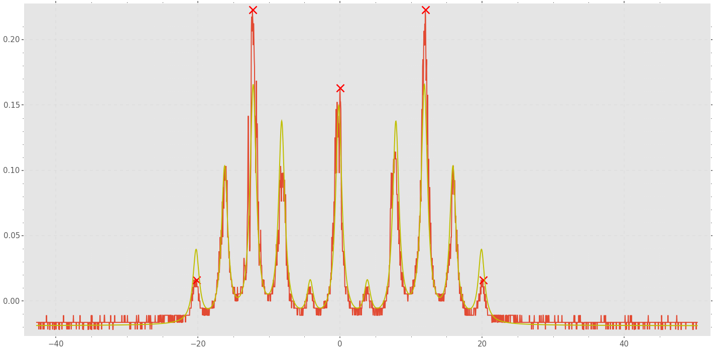

# plt.subplot(1,2,1) plt.plot(OctaBlock_ErrSig["t"],OctaBlock_ErrSig["V"]) plt.subplot(1,2,2) plt.plot(OctaBlock_Trans["t"],OctaBlock_Trans["V"])  print 0.3/1.2E6 print 0.15/4000.0


    OctaBlock_LockSpectra=np.genfromtxt(fdir+"OctaBlockCavity_2/OctaBlock_lock_3.CSV",
                                                           skip_header=4,
                                                           delimiter='\t',
                                                           names=["f","A","Hz"])
    BW=5 #Hz
    dslope=0.2/1.0E6 #V/Hz
    OctaBlock_LockSpectra["Hz"] = np.sqrt(10**((OctaBlock_LockSpectra["A"])/10.0) * 0.001 * 50 ) /(np.sqrt(BW)*dslope)
    WNL = (np.sum(OctaBlock_LockSpectra["Hz"])  / (len(OctaBlock_LockSpectra["Hz"])))
    print 'Effective linewidth %f Hz'%(np.pi * (WNL)**2 )
    plt.loglog(OctaBlock_LockSpectra["f"], OctaBlock_LockSpectra["Hz"])
    plt.loglog(OctaBlock_LockSpectra["f"],[WNL]*len(OctaBlock_LockSpectra["f"]),'--')
    plt.loglog(OctaBlock_LockSpectra["f"],[np.sqrt(4000 / (np.pi*2))]*len(OctaBlock_LockSpectra["f"]),'--')
    plt.annotate("white noise level effective linewidth 440Hz", xy=(1E3, 10)  )
    plt.annotate("white noise level 4000Hz", xy=(1E3, 30)  )
    
    plt.xlabel('Hz')
    plt.ylabel(r'$Hz$ / $\sqrt{Hz}$')
    plt_setup(plt,0)



    Effective linewidth 436.167754 Hz

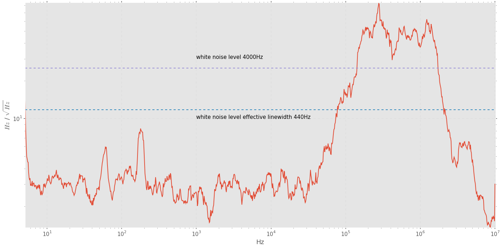


    ULE_LockSpectra=np.genfromtxt(fdir+"ULE_cavityspectra/NEWPORT_PI30k_MG455.CSV",
                                                           skip_header=4,
                                                           delimiter='\t',
                                                           names=["f","A","Hz"])
    BW=5 #Hz
    dslope=0.1/4.4E3 #V/Hz
    ULE_LockSpectra["Hz"] = np.sqrt(10**((ULE_LockSpectra["A"])/10.0) * 0.001 * 50 ) /(np.sqrt(BW)*dslope)
    WNL = (np.sum(ULE_LockSpectra["Hz"])  / (len(ULE_LockSpectra["Hz"])))
    print 'White noise level = %f Hz / sqrt(Hz) '%(WNL) 
    print 'Effective linewidth %f Hz'%( (WNL**2*np.pi ))
    plt.loglog(ULE_LockSpectra["f"], ULE_LockSpectra["Hz"])
    plt.loglog(ULE_LockSpectra["f"],[WNL]*len(ULE_LockSpectra["f"]),'--')
    plt.loglog(ULE_LockSpectra["f"],[np.sqrt(1 / (np.pi*2))]*len(ULE_LockSpectra["f"]),'--')
    plt.annotate("white noise level effective linewidth 20mHz", xy=(0.5E3, 0.7E-1)  )
    plt.annotate("white noise level 1Hz", xy=(0.5E3, 3E-1)  )
    plt.xlabel('Hz')
    plt.ylabel(r'$Hz$ / $\sqrt{Hz}$')
    plt_setup(plt,0)



    White noise level = 0.096299 Hz / sqrt(Hz) 
    Effective linewidth 0.029133 Hz

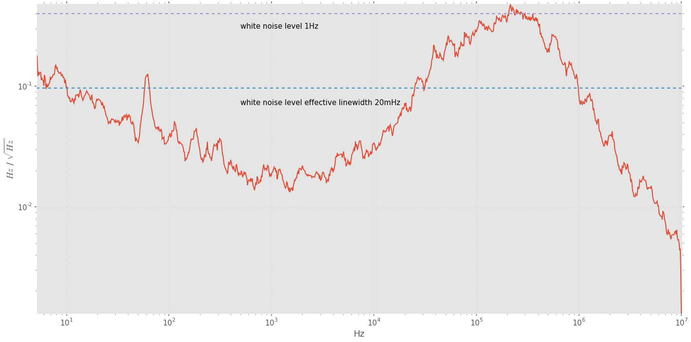


    ACMOD=np.genfromtxt(fdir+"ACMOD_BIAST/FreqMod_response/FreqResp.CSV",
                                                           skip_header=1,
                                                           delimiter=',',
                                                           names=["f","A"])
    ACMOD["A"][:3] = 150./250.*ACMOD["A"][:3]  #changed drive voltage
    
    plt.loglog(ACMOD["f"],ACMOD["A"])
    plt_setup(plt,0)
    plt.xlabel("MHz")
    plt.ylabel(r"Mod. depth $\beta$")
    plt.title("Modulation depth using BIAS-T configured ACMOD @fixed drive voltage 4-50MHz")


    <matplotlib.text.Text at 0x1697e4210>

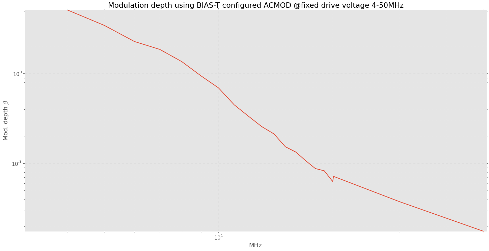


    DCMOD_Tran=np.genfromtxt(fdir+"Transmission_modulation/Transmission_mag.CSV",
                                                           skip_header=4,
                                                           delimiter='\t',
                                                           names=["f","A","phi"])
    DCMOD_Tranp=np.genfromtxt(fdir+"Transmission_modulation/Transmission_phase.CSV",
                                                           skip_header=4,
                                                           delimiter='\t',
                                                           names=["f","phi","n"])
    
    DCMOD_Tran["phi"]=DCMOD_Tranp["phi"]
    DCMOD_Tran["A"] = np.sqrt(10**((DCMOD_Tran["A"]+10)/10.0) * 0.001 * 50  )*np.sqrt(2) / (2* 0.3)
    
    ACMOD=np.genfromtxt(fdir+"Transmission_modulation/sidebands/FreqMod.CSV",
                                                           skip_header=1,
                                                           delimiter=',',
                                                           names=["f","A"])
    
    plt.loglog(ACMOD["f"]*1E6,ACMOD["A"]*8.90194695688E-05*np.sqrt(8)/0.8,"bx")
    plt.xlabel("Hz")
    plt.ylabel(r"Mod. depth $\beta$")
    plt.title("Modulation depth @fixed drive voltage 3kHz-50MHz")
    
    
    
    #excitation amplitude
    print np.sqrt(10**((-40)/10.0) * 0.001 * 50 )  
    plt.loglog(DCMOD_Tran["f"], DCMOD_Tran["A"],"b-")
    
    
    ACMOD1=np.genfromtxt(fdir+"ACMOD_BIAST/FreqMod_response/FreqResp.CSV",
                                                           skip_header=1,
                                                           delimiter=',',
                                                           names=["f","A"])
    ACMOD1["A"][:3] = 150./250.*ACMOD1["A"][:3]  #changed drive voltage
    
    plt.loglog(ACMOD1["f"]*1E6,ACMOD1["A"]*8.90194695688E-05*np.sqrt(8)/0.15,'yo')
    
    def test(f):
        return 0.3*(1/(f/1.02E6 +1))*(1/(f/0.6E6 +1)**2) 
    testing = np.vectorize(test)
    
    #plt.loglog(np.concatenate( ( DCMOD_Tran["f"],ACMOD["f"]*1E6 ),axis=0),np.absolute(testing(1j*(np.concatenate( ( DCMOD_Tran["f"],ACMOD["f"]*1E6 ),axis=0)))))
    
    plt_setup(plt,0)



    0.0022360679775

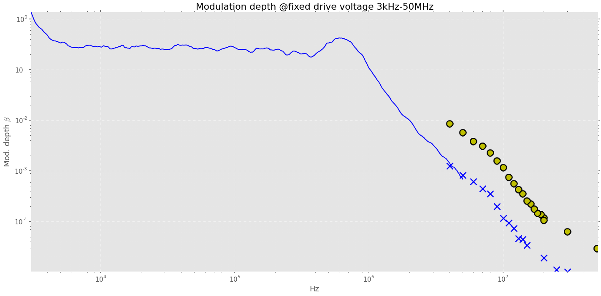


    plt.semilogx(DCMOD_Tran["f"],DCMOD_Tran["phi"])
    #plt.semilogx(np.concatenate( ( DCMOD_Tran["f"],ACMOD["f"]*1E6 ),axis=0),180+(180 / np.pi)*np.angle(testing(1j*(np.concatenate( ( DCMOD_Tran["f"],ACMOD["f"]*1E6 ),axis=0)))))
    
    plt.xlabel('Hz')
    plt.ylabel('deg')
    plt_setup(plt,0)


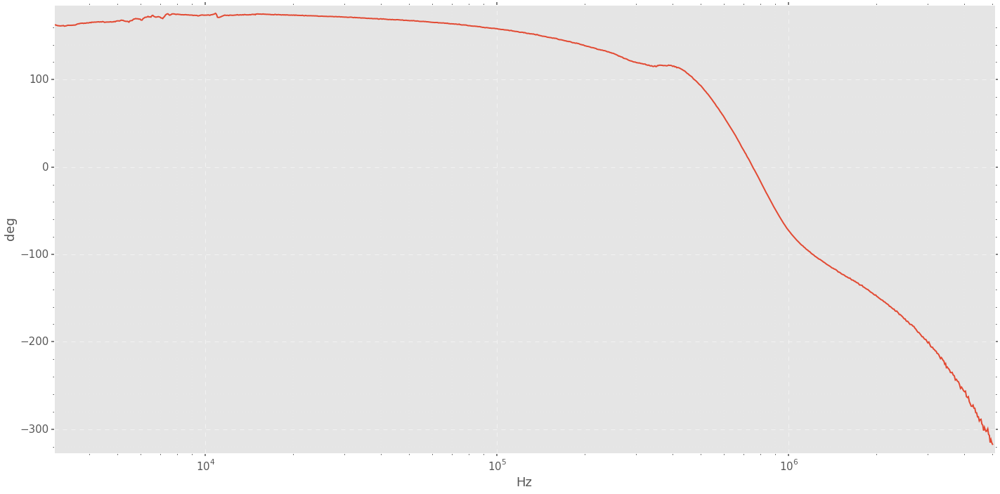


    #AOM modulation depth
    ACMOD=np.genfromtxt(fdir+"ULE_cavityspectra/AOM_MOD/ULEMod.CSV",
                                                           skip_header=1,
                                                           delimiter=',',
                                                           names=["f","A"])
    
    
    plt.loglog(ACMOD["f"],ACMOD["A"])
    plt.xlabel("kHz")
    plt.ylabel(r"Modulation Depth $\beta$")
    plt_setup(plt,0)


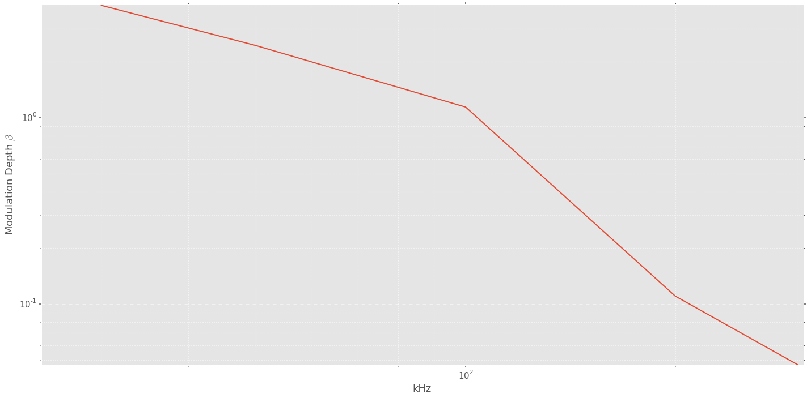


    DCMOD_Tran=np.genfromtxt(fdir+"Transmission_modulation/Transmission_mag.CSV",
                                                           skip_header=4,
                                                           delimiter='\t',
                                                           names=["f","A","phi"])
    DCMOD_Tranp=np.genfromtxt(fdir+"Transmission_modulation/Transmission_phase.CSV",
                                                           skip_header=4,
                                                           delimiter='\t',
                                                           names=["f","phi","n"])
    
    DCMOD_Tran["phi"]=DCMOD_Tranp["phi"]
    DCMOD_Tran["A"] = np.sqrt(10**((DCMOD_Tran["A"]+10)/10.0) * 0.001 * 50  )*np.sqrt(2) / (2* 0.3)
    
    ACMOD=np.genfromtxt(fdir+"Transmission_modulation/sidebands/FreqMod.CSV",
                                                           skip_header=1,
                                                           delimiter=',',
                                                           names=["f","A"])
    
    plt.loglog(ACMOD["f"]*1E6,ACMOD["A"]*8.90194695688E-05*np.sqrt(8)/0.8,"bx")
    plt.xlabel("MHz")
    plt.ylabel(r"Mod. depth $\beta$")
    plt.title("Modulation depth using AC configured ACMOD @fixed drive voltage 3kHz-50MHz")
    
    
    
    #excitation amplitude
    print np.sqrt(10**((-40)/10.0) * 0.001 * 50 )  
    plt.loglog(DCMOD_Tran["f"], DCMOD_Tran["A"],"b-")
    
    
    ACMOD1=np.genfromtxt(fdir+"ACMOD_BIAST/FreqMod_response/FreqResp.CSV",
                                                           skip_header=1,
                                                           delimiter=',',
                                                           names=["f","A"])
    ACMOD1["A"][:3] = 150./250.*ACMOD1["A"][:3]  #changed drive voltage
    
    plt.loglog(ACMOD1["f"]*1E6,ACMOD1["A"]*8.90194695688E-05*np.sqrt(8)/0.15,'yo')
    
    
    
    plt_setup(plt,0)


    5.491812087098392


    #FALC resposne
    GC=np.genfromtxt(fdir+"PDHSystem/FALC_30db_0dbm_MAG.CSV",
                                                           skip_header=4,
                                                           delimiter='\t',
                                                           names=["f","mag","phase"])
    GC2=np.genfromtxt(fdir+"PDHSystem/FALC_30db_0dbm_phase.CSV",
                                                           skip_header=4,
                                                           delimiter='\t',
                                                           names=["f","phase","n"])
    #Laser system response (input +FALC input)
    GS=np.genfromtxt(fdir+"PDHSystem/MODFALC_30db_0dbm_MAG.CSV",
                                                           skip_header=4,
                                                           delimiter='\t',
                                                           names=["f","mag","phase"])
    GS2=np.genfromtxt(fdir+"PDHSystem/MODFALC_30db_0dbm_phase.CSV",
                                                           skip_header=4,
                                                           delimiter='\t',
                                                           names=["f","phase","n"])
    GS["mag"] = np.sqrt(10**((GS["mag"] )/10.0) * 0.001 * 50 )*2.5
    GS["phase"] = GS2["phase"] * np.pi / 180.0
    GC["mag"] = np.sqrt(10**((GC["mag"])/10.0) * 0.001 * 50 ) 
    GC["phase"] = GC2["phase"] * np.pi / 180.0  - np.pi
    plt.subplot(3,1,1)
    plt.loglog(GC["f"], GC["mag"])
    plt.loglog(GS["f"], GS["mag"])
    
    plt.subplot(3,1,2)
    plt.semilogx(GC["f"], GC["phase"])
    plt.semilogx(GS["f"], GS["phase"])
    
    Ts = GS["mag"] * np.exp(1j* GS["phase"])
    Tc =  GC["mag"] * np.exp(1j* GC["phase"])
    GL = Ts /( (1 - Ts) * Tc )
    
    plt.subplot(3,1,3)
    plt.loglog(GS["f"],np.absolute(GL))
    plt_setup(plt,0)



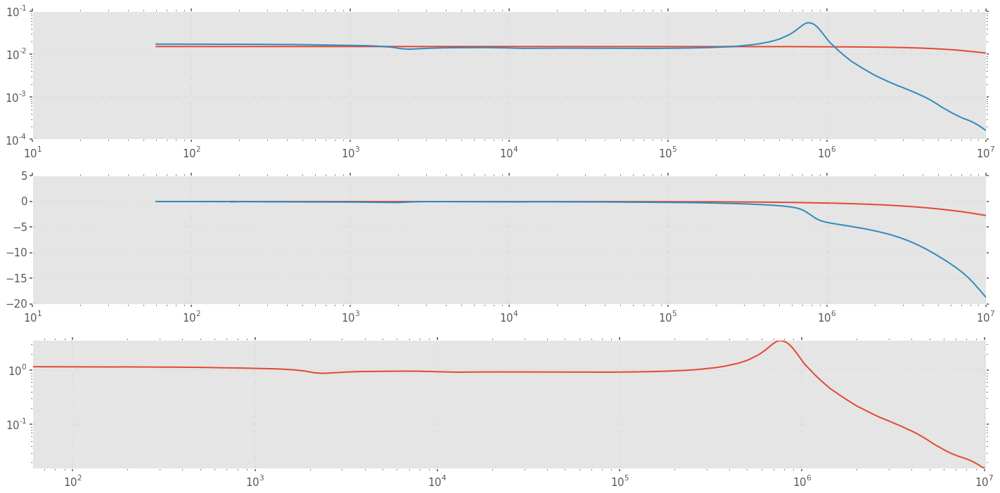


    def test(f):
        return (1/(f/1.1E6 +1))*(1/(f/0.7E6 +1)*(1/(f/2.0E6 +1)))*np.exp(-f / (1/1550E-9))
    testing = np.vectorize(test)
    
    plt.loglog(GS["f"],np.absolute(GL))
    plt.loglog(GS["f"],np.absolute(testing(1j*GS["f"])))


    [<matplotlib.lines.Line2D at 0x173122910>]

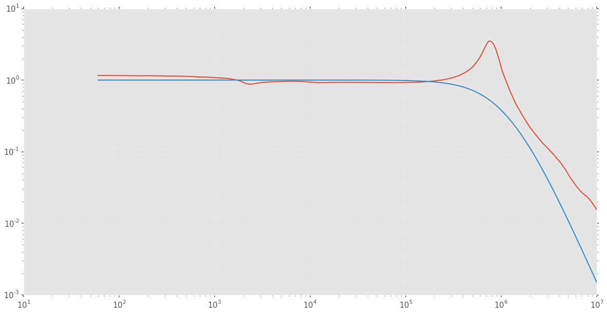


    plt.semilogx(GS["f"],np.angle(GL)*180.0 / np.pi)
    plt.semilogx(GS["f"],(180.0 / np.pi )*np.angle(testing(1j*GS["f"])))


    [<matplotlib.lines.Line2D at 0x16a0abcd0>]

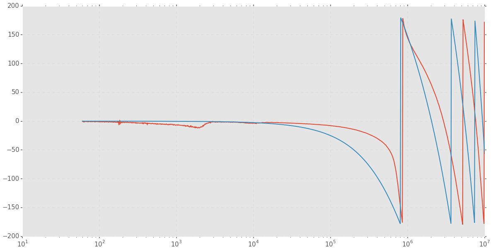


    OctaLock=np.genfromtxt(fdir+"OctaBlockCavity_2/Trace_0049.CSV",
                                                           skip_header=45,
                                                           delimiter=',',
                                                           names=["f","A"])
    
    plt.plot(OctaLock["f"]*1E-6,OctaLock["A"] +45)
    plt_setup(plt,0)
    plt.xlabel("MHz")
    plt.ylabel(r"db")
    plt.title("Reflection photodiode tap")


    <matplotlib.text.Text at 0x1649a8250>

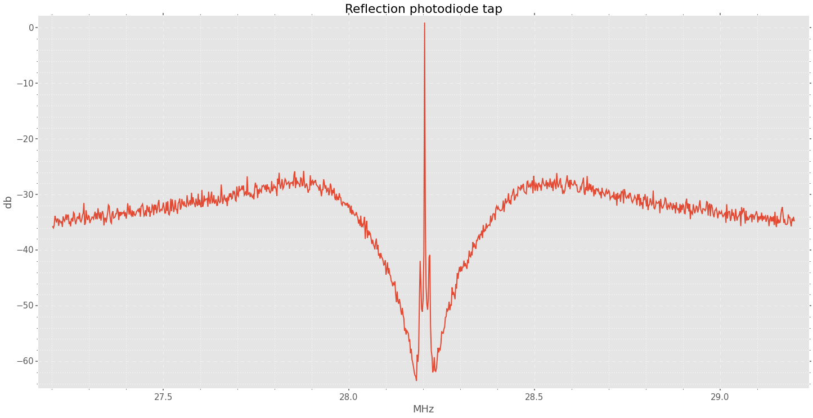


    %matplotlib inline
    import numpy as np
    import matplotlib.pyplot as plt
    from scipy.optimize import curve_fit
    import os 
    fdir = os.getcwd()
    plt.style.use(fdir +'/2016-04-30/notebook.mplstyle')
    
    
    def plt_setup(obj, params):     
                obj.margins(0.02)
                obj.margins(0.02)
                obj.minorticks_on()
                obj.grid(b=True, which='minor', color='w', linestyle=':',linewidth=0.1)
                obj.tight_layout()
    
    import UsefulFunctions
    reload(UsefulFunctions)
    fitfunc=UsefulFunctions.MFunctions()
    print UsefulFunctions.MFunctions().BesselJ(2,2)
    fdir="/Users/Michael/Dropbox (MIT)/Quanta/Twins/Data/2016-06-12/"
    
    fname="0035"
    OctaBlock_ErrSig=np.genfromtxt(fdir+"ULE_cavityspectra/AOM_MOD/ALL%s/F%sCH3.CSV"%(fname,fname),
                                                           skip_header=19,
                                                           delimiter=',',
                                                           names = ["n1","n2","n3","t","V"])
    OctaBlock_Trans=np.genfromtxt(fdir+"ULE_cavityspectra/AOM_MOD/ALL%s/F%sCH3.CSV"%(fname,fname),
                                                           skip_header=19,
                                                           delimiter=',',
                                                           names = ["n1","n2","n3","t","V"])
    
    Fmod=100
    
    import Peak_detect
    TransmissionPeaks=Peak_detect.detect_peaks(OctaBlock_Trans["V"], mph=0.05, mpd=150)
    print TransmissionPeaks
    
    OctaBlock_Trans["t"] = (OctaBlock_Trans["t"]-(OctaBlock_Trans["t"][TransmissionPeaks[2]]))*(Fmod/(OctaBlock_Trans["t"][TransmissionPeaks[1]]
                                                                            -OctaBlock_Trans["t"][TransmissionPeaks[2]]) )
    
    guess=[0,Fmod,0.5,1,-.001,.5]
    popt, pcov = curve_fit(fitfunc.CavitySideBands, OctaBlock_Trans["t"],OctaBlock_Trans["V"],p0=guess)
    print popt
    
    caption=[""]*4
    caption[0]= r"fitted:"
    caption[1]= r"Linewidth $\Gamma = 2\pi %.1f kHz$"%(popt[-1])
    caption[2]= r"Mod. depth $\beta = %.2f$"%(popt[-3])
    
    testfunc = np.vectorize(fitfunc.CavitySideBands)
    print OctaBlock_Trans["t"][TransmissionPeaks]
    #plt.plot(OctaBlock_ErrSig["t"],OctaBlock_ErrSig["V"])
    plt.plot(OctaBlock_Trans["t"],OctaBlock_Trans["V"])
    plt.plot(OctaBlock_Trans["t"][TransmissionPeaks], OctaBlock_Trans["V"][TransmissionPeaks],'rx')
    plt.plot(OctaBlock_Trans["t"],testfunc(OctaBlock_Trans["t"],popt[0],popt[1],popt[2],popt[3],popt[4],popt[5]),'y-')
    plt.xlabel("kHz")
    plt.ylabel("V")
    plt.title("Scan Across ULE cavity with 100kHz AOM modulation")
    
    plt.annotate("\n".join(caption),xy=(200,0.4))
    print r"Linewidth  FWHM= 2\pi %f MHz"%(popt[-1])
    print "Modulation depth beta = %f "%(popt[3])
    plt_setup(plt,0)



    0.352834028616
    [ 794 1018 1252 1478 1702]
    [  1.24564352e+00   9.81089575e+01   7.58575037e-01   1.14465083e+00
       6.66055584e-03   5.70564337e+00]
    [ 195.72649573  100.           -0.          -96.58119658 -192.30769231]
    Linewidth  FWHM= 2\pi 5.705643 MHz
    Modulation depth beta = 1.144651 

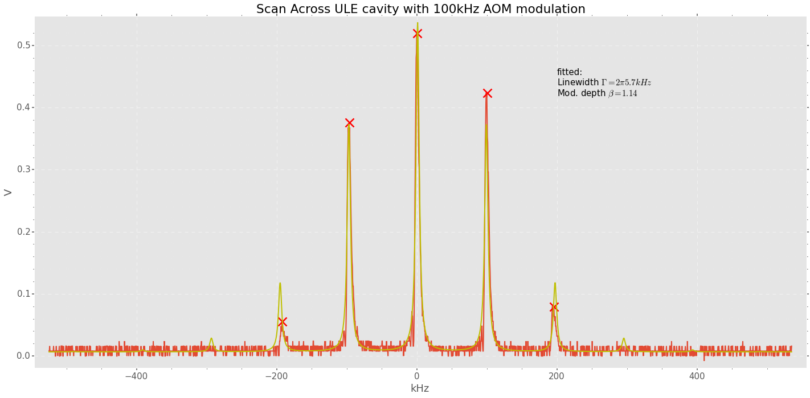


    np.sqrt(5.7**2-4.4**2)


    3.6235341863986874


    np.concatenate( ( DCMOD_Tran["f"],ACMOD["f"]*1E6 ),axis=0)


    array([  3.02562680e+03,   3.05125359e+03,   3.07688039e+03, ...,
             6.00000000e+06,   5.00000000e+06,   4.00000000e+06])


    

